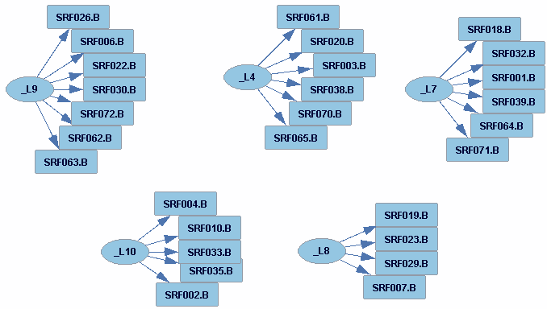
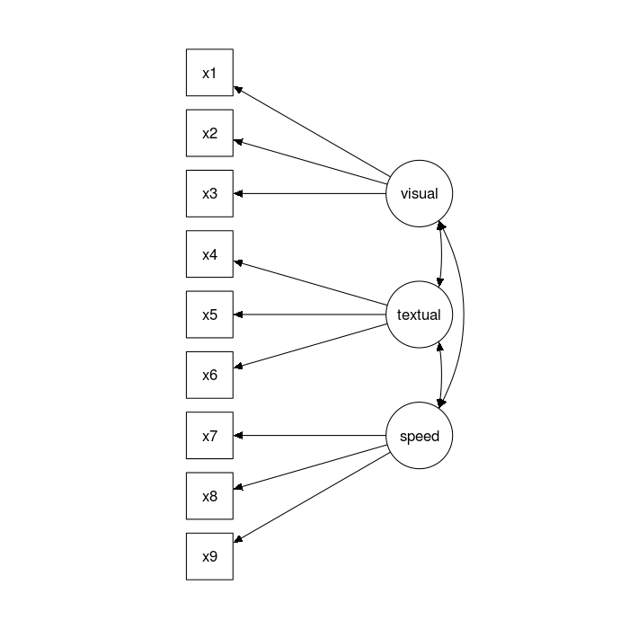

## Intro

We are interested in determining the following latents: L4, L7, L9, and L10



There are two problems at hand

1. There are missing values in this dataset that need to be dealt with
2. Then the latents need to be predicted by the `lavaan` package in `R`. We have a couple options here, and potentially some problems.

## Looking at the missing values

```{r, echo = T}
suppressPackageStartupMessages(
library(tidyverse)
)
setwd("~/work/RAISE")
```
```{r}
RAISE <- suppressMessages(
read_csv("./alldata.csv", progress = F)
)
# turn NaNs into NAs
library("parallel")
RAISE <-  as.data.frame(
  mclapply(RAISE, function(x) {ifelse(is.nan(x), NA, x)}
  )
)
```

I think the first thing to do is to the missing data pattern in the variables of interest.
```{r fig1, fig.width=11, fig.height=5.5, out.width=11, out.height=5.5}
VARS_WE_CARE_ABOUT <- select(RAISE, c(SRF026.B, SRF006.B, SRF022.B, SRF030.B, SRF072.B, SRF062.B, SRF063.B, SRF004.B, SRF010.B, SRF033.B, SRF035.B, SRF002.B , SRF018.B, SRF032.B, SRF001.B, SRF039.B, SRF064.B, SRF071.B, SRF061.B, SRF020.B, SRF003.B, SRF038.B, SRF070.B, SRF065.B))

library(VIM)
aggr(VARS_WE_CARE_ABOUT, col=c('white','red'), numbers = T, sortVars = T, labels = names(VARS_WE_CARE_ABOUT), prop = F, 
    cex.axis = 1, gap = 2, ylab = c("Histogram of missing data","Pattern of missing data"))
```

We can glean a couple things from this data. 

1. 367 of the 404 observations are complete with respect to subset of variables are working with. So, about 90% of our data is complete.
2. There are 2 observations that are completely missing. I am going to drop these observations.


```{r}
# hack to drop those missing obs from the dataset(s)
RAISE <- RAISE %>% drop_na(SRF032.B)
VARS_WE_CARE_ABOUT <- VARS_WE_CARE_ABOUT %>% drop_na(SRF032.B)
```

Now, we have two options to deal with the rest of the missing data. Omitting the rows with missing data seems unwise to me, since we don't have that many samples to work with. That leaves us the option to impute, or perform CFA only on complete rows. The missing data pattern implies the data is actually almost complete...
```{r}
1 - sum(is.na(VARS_WE_CARE_ABOUT))/(402*24)
```

Relatively few entries are missing. So, I think imputing will perform well here.

```{r}
# lavaan would like these to be kept as ordered variables instead of continuous
VARS_WE_CARE_ABOUT <- as.data.frame(
  mclapply(VARS_WE_CARE_ABOUT, function(x) {as.ordered(x)}
  )
)
# This variable is an integer from 1-100 (really its 1-59). 
# It is on the different scale then the rest, so I'm going to normalize it after I impute it
VARS_WE_CARE_ABOUT$SRF072.B <- as.double(VARS_WE_CARE_ABOUT$SRF072.B)

library(mice)
RAISE_imp <- mice(VARS_WE_CARE_ABOUT, m = 5, printFlag = F )
mice.imp <- NULL

for (i in 1:5) {
  mice.imp[[i]] <- complete(RAISE_imp, i, inc=FALSE)  
  mu <- mean(mice.imp[[i]]$SRF072.B)
  sd <- sd(mice.imp[[i]]$SRF072.B)
  mice.imp[[i]]$SRF072.B <- 1/sd * (mice.imp[[i]]$SRF072.B - mu) 
}
rm(mu, sd)  


```
### Performing CFA with `lavaan`
Now, we need to specify the latent variable model given by Erich's graph. In `lavaan`, the syntax is
```{r}
lv.model <- 'L9 =~ SRF026.B + SRF006.B + SRF022.B + SRF030.B + SRF072.B + SRF062.B + SRF063.B
             L10 =~ SRF004.B + SRF010.B + SRF033.B + SRF035.B + SRF002.B
             L7 =~ SRF018.B + SRF032.B + SRF001.B + SRF039.B + SRF064.B + SRF071.B
             L4 =~ SRF061.B + SRF020.B + SRF003.B + SRF038.B + SRF070.B + SRF065.B
            '
```
Now, we are ready to fit the models
```{r}
library(lavaan)
fits <- c(
cfa(lv.model, data = mice.imp[[1]]),
cfa(lv.model, data = mice.imp[[2]]),
cfa(lv.model, data = mice.imp[[4]]),
cfa(lv.model, data = mice.imp[[3]]),
cfa(lv.model, data = mice.imp[[5]])
)
```
As we can see, there is an error when `lavaan` fits a CFA on all these imputed datasets. (I'm pretty sure the zero.table.cells is unimportant). The covariance / correlation matrices are not positive-definite. Now, `lavaan` refuses to make predictions when this happens, so strictly speaking, we need to look at what `lavaan` thinks the covariance/correlation matrices are.

```{r}
inspect(fits[[1]], "cov.lv")
# not good
eigen(inspect(fits[[1]], "cov.lv"))$values
# notice how estimated correlation matrix has values > 1
inspect(fits[[1]], "cor.lv")
```

Assuming all the variable are actually continuous instead of ordered will allow `lavaan` to make predictions (Also: there is a paper I need to read that seems to suggest I _can_ do this), but the problem of non positive definiteness remains, so I do not trust the predictions.

I don't know a whole lot about CFAs, or SEM, but from what I'm reading on the internet, it seems like the model isn't correctly specified. I don't know if that means that we need to specify the covariances between latents, or if there's something off elsewhere.

## Trying to work around the errors
After talking to Erich, he suggested to try fitting with `sem()` instead of `cfa()`, and try to fit each independently.
### Fitting SEM instead of a CFA
```{r}
fits <- c(
sem(lv.model, data = mice.imp[[1]]),
sem(lv.model, data = mice.imp[[2]]),
sem(lv.model, data = mice.imp[[4]]),
sem(lv.model, data = mice.imp[[3]]),
sem(lv.model, data = mice.imp[[5]])
)
```
No dice! 

### Fitting each latent model separately.

```{r}
models <- c(
'L9 =~ SRF026.B + SRF006.B + SRF022.B + SRF030.B + SRF072.B + SRF062.B + SRF063.B',
'L10 =~ SRF004.B + SRF010.B + SRF033.B + SRF035.B + SRF002.B',
'L7 =~ SRF018.B + SRF032.B + SRF001.B + SRF039.B + SRF064.B + SRF071.B',
'L4 =~ SRF061.B + SRF020.B + SRF003.B + SRF038.B + SRF070.B + SRF065.B'
)

fits <- c(
cfa(models[1], data = mice.imp[[1]]),
cfa(models[1], data = mice.imp[[2]]),
cfa(models[1], data = mice.imp[[4]]),
cfa(models[1], data = mice.imp[[3]]),
cfa(models[1], data = mice.imp[[5]])
)

latent_estimate <- c()
for ( fit in fits) {
latent_estimate <- cbind(latent_estimate, predict(fit))
}
```
So, we get no errors now. The question of how to pool the results remains. I think we should take a look the covariance matrix of imputed models.

```{r}
colnames(latent_estimate) = paste(colnames(latent_estimate), "_" , seq(1:5) , sep = "")
cov(latent_estimate)
```
As we can see, the predictions themselves are so close that we can just average them (or we could pick one). The most correct would be to pool the covariance matrices generated by `lavaan`, but I do not think that is necessary given how close everything is.

### Some code and some comments
This code fits 4 1-factor models (is this the correct way to say it?) and appends them to RAISE. It prints out the fit statistics ([an explanation of them can be found here](http://davidakenny.net/cm/fit.htm)) on each model and the above covariance matrix for latent.  **BE SURE TO READ TILL THE END** 
```{r}
models <- c(
'L9 =~ SRF026.B + SRF006.B + SRF022.B + SRF030.B + SRF072.B + SRF062.B + SRF063.B',
'L10 =~ SRF004.B + SRF010.B + SRF033.B + SRF035.B + SRF002.B',
'L7 =~ SRF018.B + SRF032.B + SRF001.B + SRF039.B + SRF064.B + SRF071.B',
'L4 =~ SRF061.B + SRF020.B + SRF003.B + SRF038.B + SRF070.B + SRF065.B'
)

for (model in models) {
  # perform cfa on each imputed dataset for the given models
  fits <- c(
  cfa(model, data = mice.imp[[1]]),
  cfa(model, data = mice.imp[[2]]),
  cfa(model, data = mice.imp[[4]]),
  cfa(model, data = mice.imp[[3]]),
  cfa(model, data = mice.imp[[5]])
  )
  # predict value of latents from each fit
  latent_estimates <- c()
  for (fit in fits) {
  latent_estimates <- cbind(latent_estimates, predict(fit))
  }
  # hack to get name of latent
var_name <- colnames(latent_estimates)[1]
colnames(latent_estimates) <- paste(colnames(latent_estimates), "_" , seq(1:5) , sep = "")

summary(fit, fit.measures = T, estimates = F)

print(cov(latent_estimates))

estimate <- rowMeans(latent_estimates)
RAISE[var_name] <- estimate

write_csv(RAISE, "RAISE_LAT.csv")
}
```
I would like to reiterate fitting 4 1-factor models seems to imply that the covariance matrix between the latents is 0 when off the diagonal. My reasoning is based off the `lavaan` [tutorial](http://lavaan.ugent.be/tutorial/cfa.html) where the fit this model



with this syntax
```{r}
 visual =~ x1 + x2 + x3
textual =~ x4 + x5 + x6
  speed =~ x7 + x8 + x9
```  
Now, the correlation matrix between the predicted latents is
```{r}
latents <- select(RAISE, c(L9, L10, L4, L7))
cor(latents)
```
So, clearly they covary. I think talking to someone who is familiar with CFA would be a good idea. They could probably tell us if doing this thing is okay.
Also, the last thing I should mention is that I'm not sure how to deal with the observations I imputed. The most correct way to deal with this is probably

1. Impute the missing data on the full RAISE dataset (or whatever Sisi wants to do)
2. Predict latents on each set
3. Sisi does some stuff
4. Pool models

 I don't know if Sisi wants to do cross validation or bootstrap, but if she does, that would be step 0
 
```{r}
 lv.model2 <- 'L9 =~ SRF026.B + SRF006.B + SRF022.B + SRF030.B + SRF072.B + SRF062.B + SRF063.B
             L10 =~ SRF004.B + SRF010.B + SRF033.B + SRF035.B + SRF002.B
             L7 =~ SRF018.B + SRF032.B + SRF001.B + SRF039.B + SRF064.B + SRF071.B
             L4 =~ SRF061.B + SRF020.B + SRF003.B + SRF038.B + SRF070.B + SRF065.B
            L9 ~~ .0*L10
            L9 ~~ 0*L4
            L9 ~~ 0*L7
            L10 ~~ 0*L4
            L10 ~~ 0*L7
            L4 ~~ 0*L7
            L9 ~~ 0*L9
            L4 ~~ 0*L4
            L10 ~~ 0*L10
            L7 ~~ L7
            '
            library(lavaan)
fits <- c(
cfa(lv.model2, data = mice.imp[[1]]),
cfa(lv.model2, data = mice.imp[[2]]),
cfa(lv.model2, data = mice.imp[[4]]),
cfa(lv.model2, data = mice.imp[[3]]),
cfa(lv.model2, data = mice.imp[[5]])
)
```